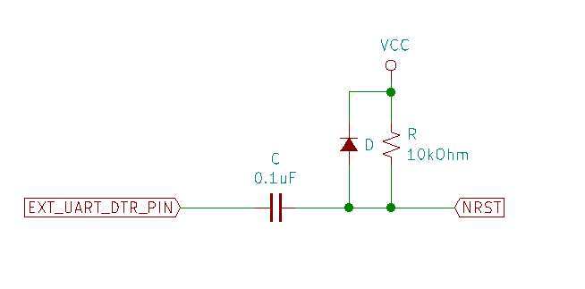

# STM32F4 Serial Bootloader
STM32F4 serial bootloader using the libraries from https://github.com/ferenc-nemeth/stm32-bootloader.

The uploader is written in Rust and the source code is located @ https://github.com/kcalden/stm32-serial-uploader.

**This bootloader assumes that UART1 is being used and the MCU has 8MHz HSE (On NUCLEO boards this is provided by the integrated ST-Link).** 

**`SystemClock_Config()` must be altered to use a different crystal.**

**`uart.c` and `uart.h` must be altered to use a different port.**

# How the bootloader works

To flash the firmware, the MCU must be reset.

When the MCU is reset, it sends a BEL character through UART1 and the host responds to this with an ACK character.

The MCU the sends its signature (ex. F411RE) for verification, telling the host what kind of MCU it is. The host responds an ACK character to pass verification.

The MCU then clears the memory reserved for the application and begins file transfer using the XMODEM protocol.

After the binary is transferred, the MCU jumps to the application code. 

# How to build for an MCU

> On Arch Linux, this requires the following packages:
>
> - arm-none-eabi-binutils
> - arm-none-eabi-gcc
> - arm-none-eabi-gdb
> - arm-none-eabi-newlib


The makefile can build for the following MCUs:

- stm32f446retx
- stm32f411retx
- stm32f411rctx

To make a binary for the MCU, cd into the directory of the make file and run `make mcu=<mcu type from the list above>`.

For example, if I was building for an STM32F411RCT6, I would run:

```
make mcu=stm32f411rctx
```
# Flash using st-flash

Erase the chip using:
```
st-flash erase
```

Then program the chip using:
```
st-flash write <path to binary> 0x8000000
```
# Recommended circuitry

The DTR reset circuitry is the same as on the Arduino, but for reference:



This will force the MCU to reset whenever the DTR pin is changed.

# Uploading binaries using the bootloader

The bootloader writes the application to address `0x8004000`. 

This means that, for each application to uploaded using this method, the linker script and `VECT_TAB_OFFSET` must be modified.

## Linker script

The flash origin in the linker script should be changed to `0x8004000` and the length must be reduced by 16kB.

For example, the file `STM32F411RETx_FLASH.ld` has the memory layout as follows:

```
MEMORY
{
    RAM (xrw)      : ORIGIN = 0x20000000, LENGTH = 128K
    FLASH (rx)      : ORIGIN = 0x8000000, LENGTH = 512K
}
```

This should be modified to:

```
MEMORY
{
    RAM (xrw)      : ORIGIN = 0x20000000, LENGTH = 128K
    FLASH (rx)      : ORIGIN = 0x8000000 + 0x4000, LENGTH = 512K - 16K
}
```

## VECT_TAB_OFFSET

For programs built using STM32CubeMX, the VECT_TAB_OFFSET is defined in `system_stm32f4xx.c`.

```c
#define VECT_TAB_OFFSET  0x00
```

should be changed to:

```c
#define VECT_TAB_OFFSET  0x4000
```

## **For PlatformIO**

If you're using the STM32 platform in PlatformIO, these changes can be specified in the `platformio.ini`.

### **Linker script**
The modified linker script can be placed into the project's root directory and the `board_build.ldscript` should then point to the linker script. For example, we can add the following line to the environment:
```ini
board_build.ldscript = "$PROJECT_DIR\modified_linker_script.ld"
```

### **VECT_TAB_OFFSET**
The new vector table offset can be added to build flags. For example, in MarlinFirmware's `platformio.ini` my board's `build_flags` should be as follows:
```ini
build_flags = ${common_stm32.build_flags}
    -DVECT_TAB_OFFSET=0x4000
```